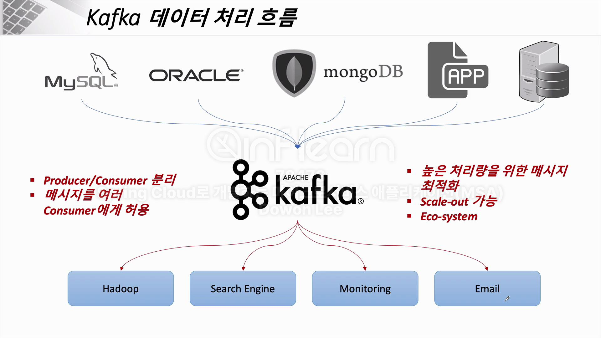

# 데이터 동기화 
## 1. 데이터 동시성 이슈

- 현재 상황은 아래와 같음
  - feign client로 order service API 호출
  - order service 인스턴스는 2개가 띄워져있으며, 각 인스턴스는 개별 h2 db 존재
  - 따라서 orders 데이터도 분산 저장 -> **데이터 동기화 문제**
- 해결책 1. 물리적 DB를 1개 사용 
  - 이렇게 할 경우 동시성 이슈(ex : 트랜잭션)을 잘 다뤄야 함

- 해결책 2. DB간의 동기화 (MQ)
  - 각 인스턴스가 MQ를 구독하고 변경된 사항이 있으면 구독하는 구조

- 해결책 3. Kafka + 물리적 DB 1개 사용
  - 아무리 많은 데이터가 들어와도 1초에 수만건의 데이터가 처리 가능한 구조(= kafka)이기 때문에 **동시성 이슈** 해결 가능

## 2. Kafka란?
- Scalar 언어로 된 오픈소스 메시지 브로커 프로젝트
- Linked in에서 개발, 2011년 오픈소스 화
- 실시간 데이터 피드를 관리하기 위해 통일된 높은 처리량, 낮은 지연 시간을 지닌 플랫폼 제공

- 메세지를 보내는 쪽이 producer, 받는 쪽이 consumer

- 현재 플젝에서는 zookerper 1대, kafka 1대를 사용할 예정이지만 실무에서는 최소 각각 3대 이상씩 사용하는 것을 권장 (안정성 측면)

## 3. Kafka의 구조

- 구동 방식
  - zookeper 먼저 킨 다음 kafka를 킴
- producer에서 메세지를 보내면 topic에 먼저 저장됨
  - consumer가 관심있는 topic을 구독하고, topic에 새로운 데이터가 있으면 구독중인 consumer에게 전달
- 멀티 클러스터링에서 topic에 있는 메시지를 몇 곳에 나눠서 저징할지 설정하는게 partition 개념

- 카프카 커텍트 : 카프카와 외부 시스템(DB 등) 간의 파이프라인 구성을 쉽게 해주는 프레임워크
- ex : MySQL에 전달된 데이터를 동시에 Oracle에 전달할때도 Kafka Connector를 통해 해당 작업 가능
