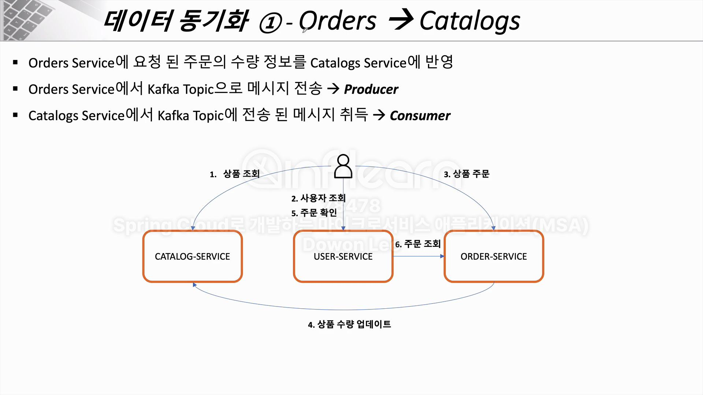
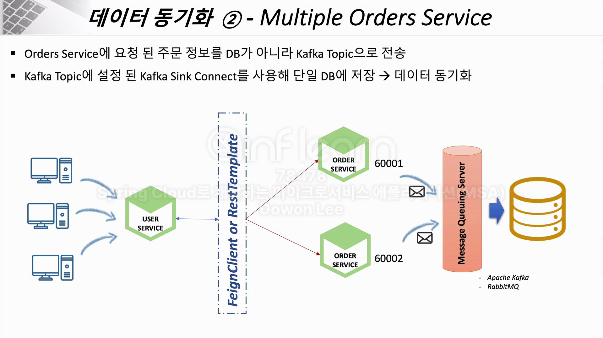

## 프로젝트에 Kafka 적용 과정

### order (주문) <-> catalog (재고) 싱크 맞추기
- order service에서 주문이 이루어지면 catalog service에서 그만큼 재고 개수가 차감되어야 함
- order service를 producer, catalog service를 consumer로 kafka를 설정
- CatalogService의 `KafkaConsumer.class`, `KafkaConsumerConfig.class` 확인
- OrderService의 `KafkaProducer.class`, `KafkaProducerConfig.class` 확인


### order (주문) 여러개의 서버의 싱크 맞추기
- order service가 여러개 띄워진 경우, 이에 따라 h2 db도 여러개로 분산되어 오더 정보가 분산되어 저장됨
- 데이터 동기화는 `Kafka Sink Connector`가 해줄 예정
- kafka connect 관련 API
``` json
등록 - POST 127.0.0.1:8083/connectors
{
"name":"my-order-sink-connect",
"config":{
    "connector.class" : "io.confluent.connect.jdbc.JdbcSinkConnector",
    "connection.url":"jdbc:mariadb://localhost:3306/mydb?allowPublicKeyRetrieval=true&useSSL=false",
    "connection.user":"root",
    "connection.password":"1234",
    "auto.create":"true",
    "auto.evolve":"true",
    "delete.enabled":"false",
    "tasks.max":"1",
    "topics":"orders"
    }
}

조회 - 127.0.0.1:8083/connectors/

상세 조회 - 127.0.0.1:8083/connectors/{connect name}/status
```


## Kafka 구동 방법
- zookeper :  ~/Desktop/Dev_Utilities/kafka_2.13-3.8.0  ./bin/zookeeper-server-start.sh ./config/zookeeper.properties
- kafka :  ⚙ dm  ~/Desktop/Dev_Utilities/kafka_2.13-3.8.0  ./bin/kafka-server-start.sh ./config/server.properties
