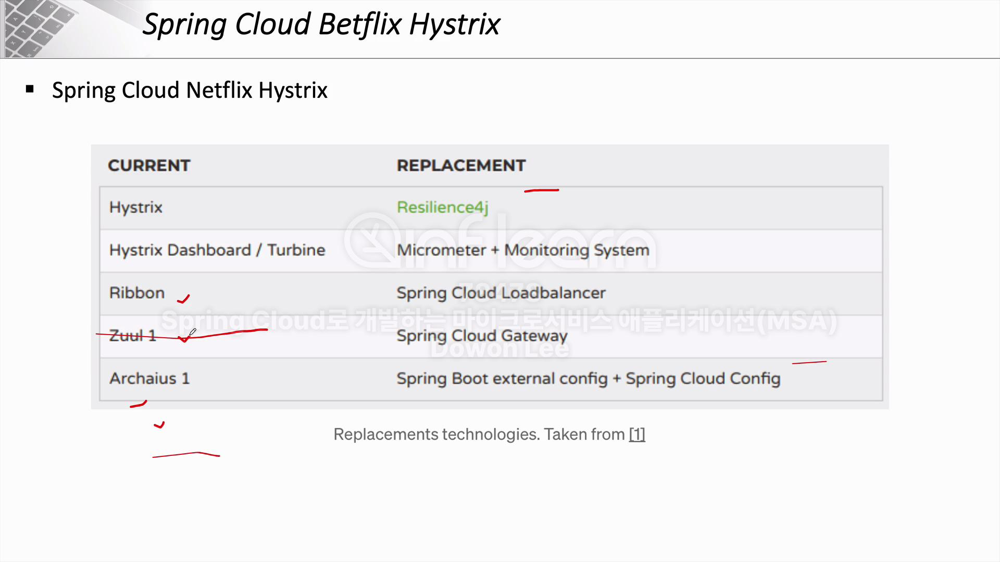
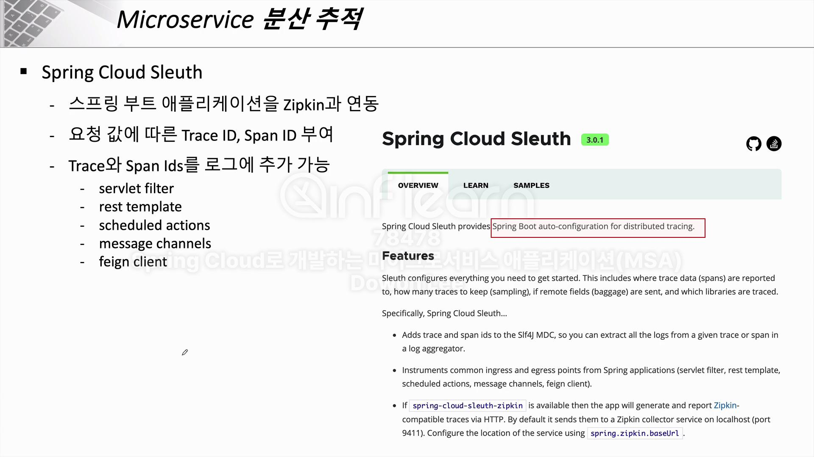

## Microservice 통신시 연쇄 오류

- `/users/{userId}`를 호출했을때, 장애는 user 도메인이 아닌 order 도메인에서 발생했는데도 user 도메인에 500 에러가 반환될 수 있음 
    - 이 경우 아래와 같은 조치들이 필요됨
    - 1. 장애가 발생한 도메인으로 더 이상 요청을 보내지 않음
    - 2. user 도메인에서 200 OK로 정상적인 값이 보내질 수 있도록 fallback method 구현 

## CircuitBreaker

- SpringBoot 2.4 버전 미만에서는 Hystrix 라이브러리로 CircuitBreaker를 구현했으나, 그 이상 버전 부터는 Resilience4j로 구현

- 결론적으로 CircuitBreaker는 장애 전파를 막고 우회할 수 있는 방법을 제공

## Zipkin

- MSA 환경에서 요청이 어느 MSA 프로젝트를 거치고 어떤 이슈가 발생했는지 로그 트레이싱을 제공
- Zipkin + Spring Cloud Slueth로 함께 사용
  - Spring Cloud Slueth : 요청 값에 따른 Trace ID, Space ID 부여  

