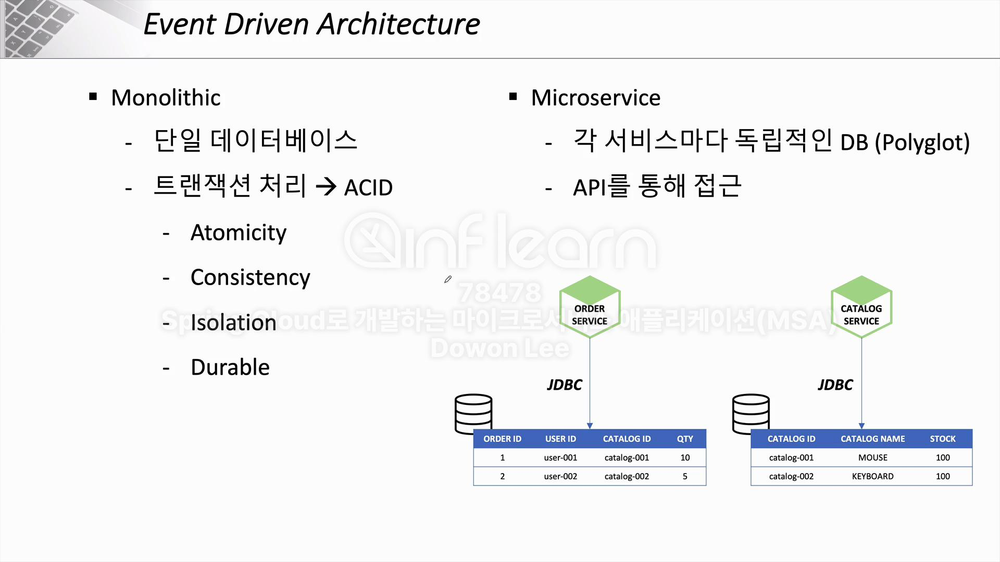
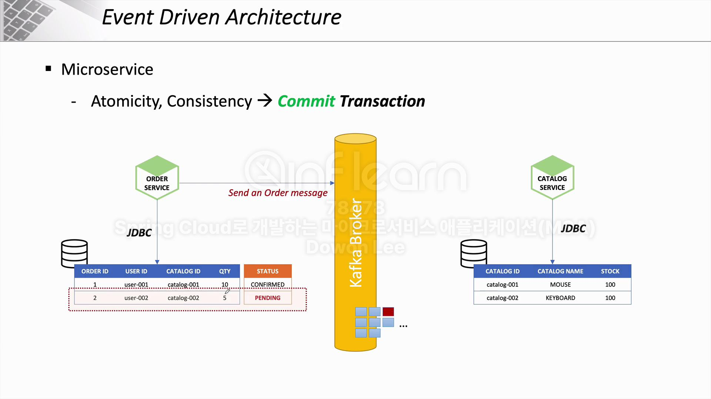
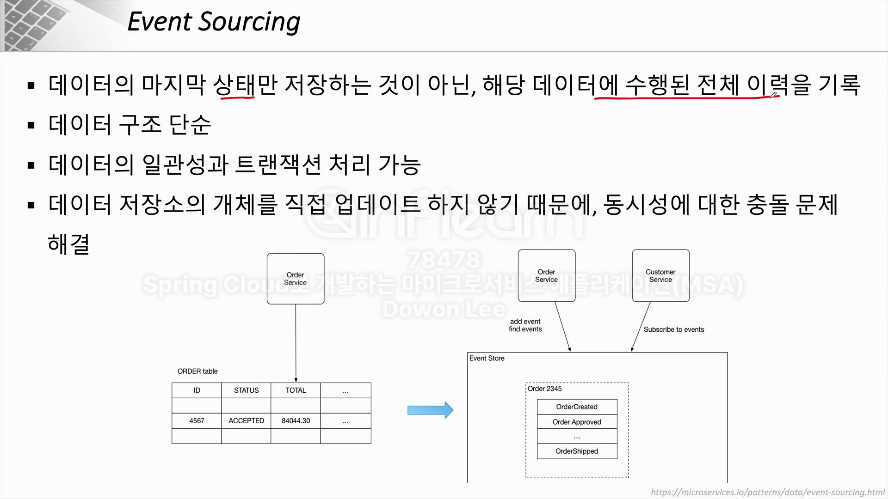
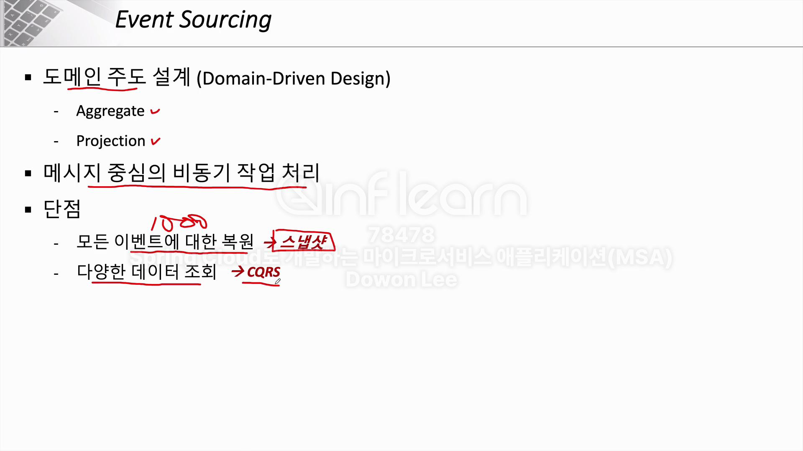
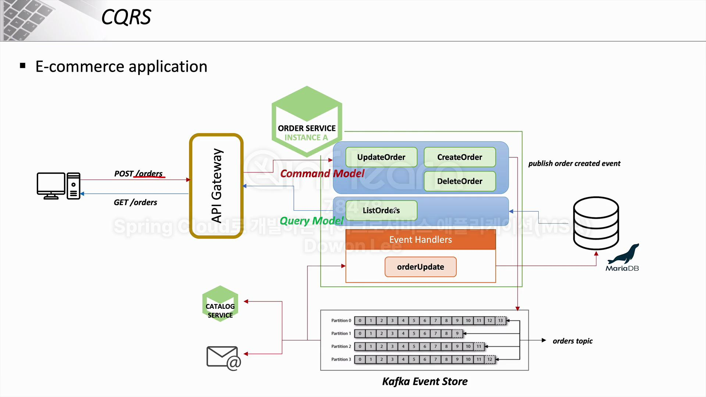
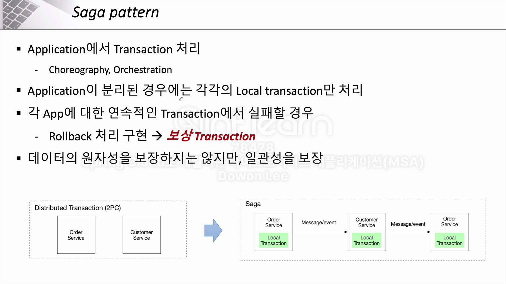
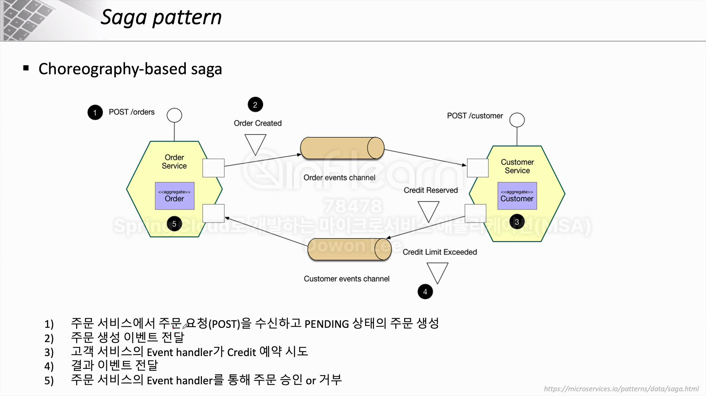
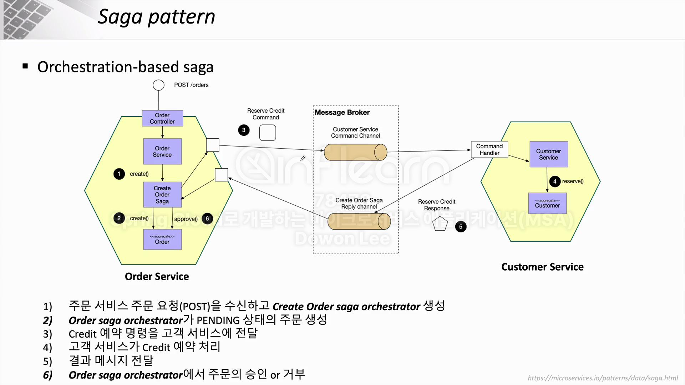

## Event Driven Architecture

- MSA에선 기존의 Monolithic에서 구현했던 Trsanaction 처리를 완벽하게 구현할 순 없음
- 위와 같이 Kafka와 같은 MQ를 활용하여 **Atomicity**, **Consistency**를 어느정도 보장할 수 있음

## Event Sourcing

- 모든 이벤트에 대한 복원 
  - 1000번의 데이터가 변경되었을때, 1000개의 트랜젝션 히스토리를 다 보는게 아니라 1 ~ 100, 101 ~ 200번까지의 트랜잭션만 갖고있는 식으로 스냅샷으로 저장 

- 다양한 데이터 조회
  - CQRS로 해결 가능 (명령과 조회의 책임 분리)
    - 상태를 변경하는 Command
    - 조회를 담당하는 Query 

## Saga Pattern

- Transaction이 실패할 경우 Rollback 처리가 구현된 **보상 Transaction**이 존재한다는게 큰 특징

- Orchestration-based saga는 중앙에 Message Broker를 통해 모든 서비스가 연결되어있음 (중앙 집중적)
- Choreography-based saga는 각각의 MSA가 필요한 정보에 따라 필요한 정보를 주고 받음
