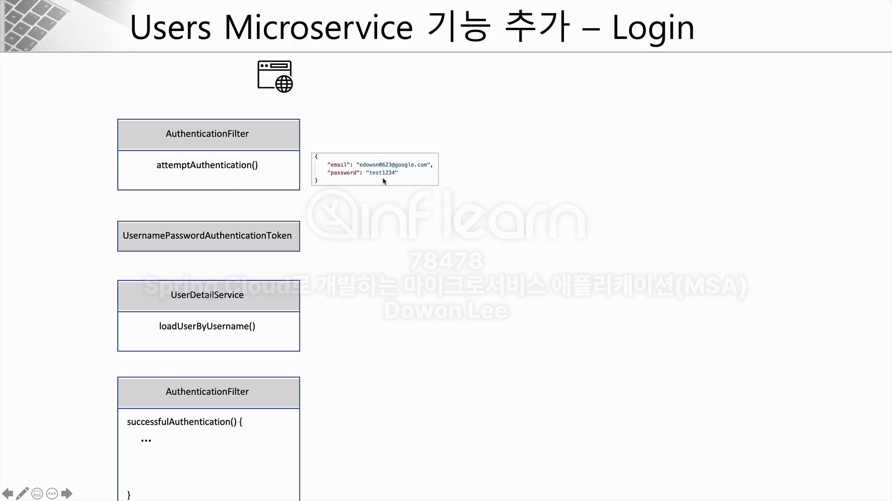
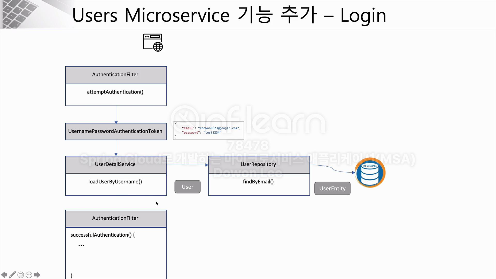
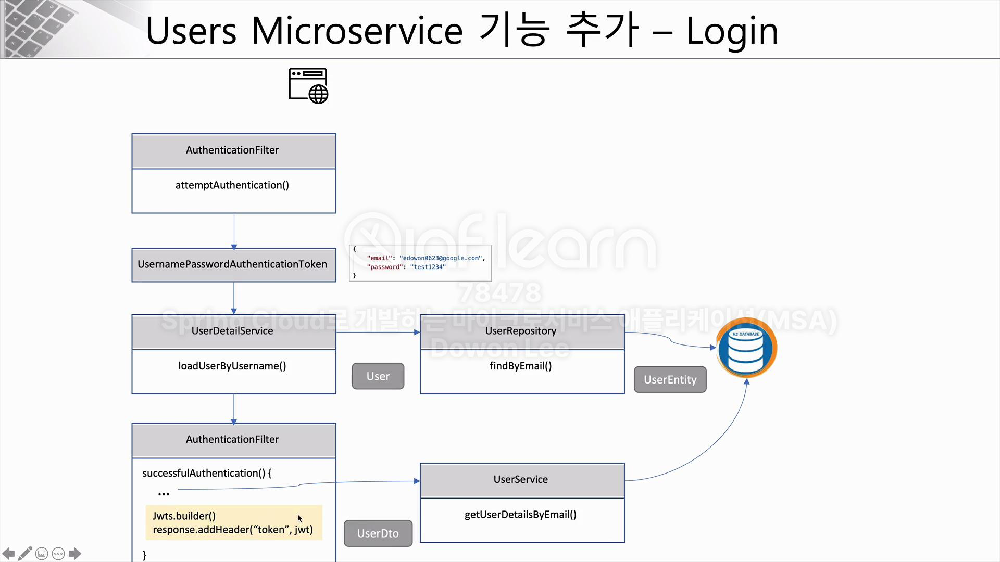

## Spring Security의 인증 과정

1. AuthenticationFilter를 거쳐 attemptAuthentication()을 호출
2. UsernamePasswordAuthenticationToken을 거쳐, 입력된 값을 기반으로 토큰 생성 
3. UserDetailService를 구현한 클래스에서 loadUserByUserName()을 호출

4. 성공시 successfulAuthentication을 호출

- 최종적으로는 위 이미지의 JWT까지 구현하는 것이 목표

## JWT
- 기존 쿠키, 세션 방식은 모바일 어플리케이션에서 유효하게 사용할 수 없음 (공유 불가)
- 렌더링된 HTML 페이지가 반환되지만, 모바일 어플리케이션에서는 JSON (or XML)과 같은 포맷 필요
- 전반적은 JWT의 특징은  섹션 7 - JWT 처리 과정 참고
