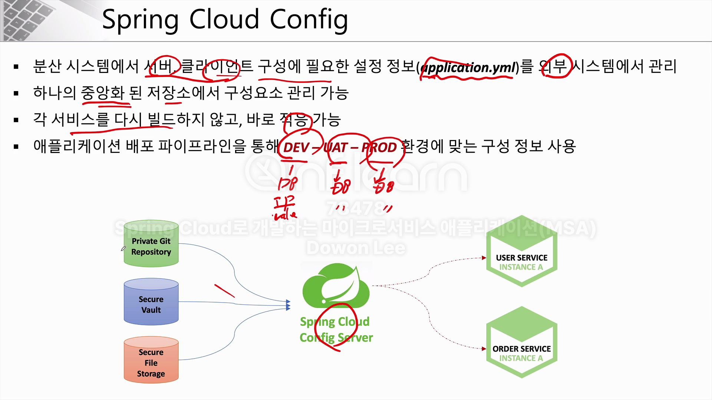
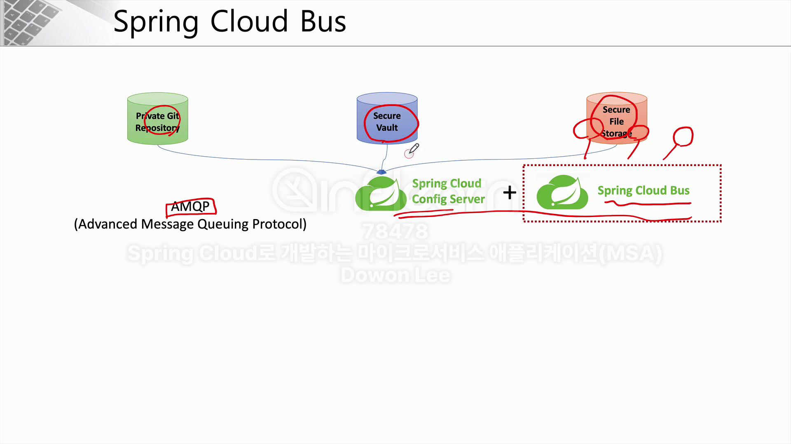

## Spring Cloud Config

## config 서버가 읽어들이는 설정 파일명의 우선 순위
- application.yml < application-name.yml < application-name-<profile>.yml (우선순위 제일 높음)

## bootstrap.yml
- bootstrap.yml 은 Spring Cloud Config 파일
- application.yml과 bootstrap.yml이 공존할 경우, 우선 순위는 후자가 높음
- SpringBoot 2.4 에서는 다시 합쳐졌지만, 그 이전 버전에서 Spring Cloud 프로젝트를 사용하고 있었다면  
  해당 설정은 application.yml에서 해주는 것이 아니라, bootstrap.yml을 만들어줌
- 일부 기업에서 아직 Springboot 2.4로 버전업을 하지 않은 이유중 하나가 이 설정을 다시 바꿔야 하기 때문

## config 변경 및 재적용
- config 파일이 변경됐을 경우, 재적용하는 방법은 크게 3개
  1. 서버 재기동 
    - ex ) user-service 플젝을 다시 구동했음
  2. Actuator Refresh
    - 서버 재부팅은 안해도 됨
    - `POST   바뀌는 서버의 ip/actuator/refresh`를 쏴주면 됨
  3. Spring Cloud Bus 사용
    - 2번보다도 더 효율적이 방법
+ Spring Boot Actuator
  - Application 상태, 모니터링
  - Metric 수집을 위한 Http End Point 제공

## Spring Cloud Bus
- 분산 시스템의 노드를 경량 메시지 브로커와 연결
- 상태 및 구성에 대한 변경 사항을 연결된 노드에게 전달 (Broadcast)

## Kafka vs RabbitMQ
- 전자는 대용량에 적압, 후자는 적은 양의 데이터를 보다 안전하게 전달하는 것에 적합
- 현재 플젝에서는 rabbitmq 사용
  - RabbitMQ는 AMQP를 구현한 오픈 소스 메시지 브로커 소프트웨어
  - AMQP : 인스턴스가 데이터를 서로 교환할 때 사용하는 방법
    - MQ를 오픈 소스에 기반한 표준 프로토콜이 AMQP(Advanced Message Queuing Protocol)
    - AMQP 자체가 프로토콜을 의미하기 때문에 이 프로토콜을 구현한 MQ 제품들은 여러가지가 있으며 그 중 하나가 RabbitMQ
